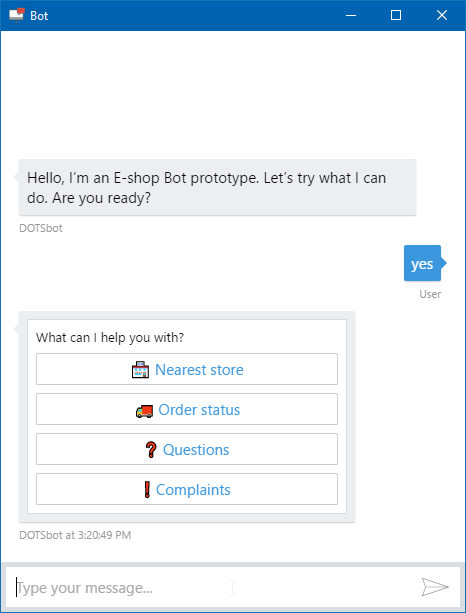

# Desktop Chatbot

Hosting Bot Framework's web chat control inside an Electron app to enable chatbot distribution independent from operating system & web browser.




## How to build it

This app is built using Electron and TypeScript. To be able to edit and build it, you need to install:

* [Node.js](https://nodejs.org/en/)
* [TypeScript](https://www.typescriptlang.org/#download-links)
  * can be installed via npm: `npm install -g typescript`
* to browse and edit the code I recommend [Visual Studio Code](https://code.visualstudio.com/)

You also need to have a [Bot Framework](http://dev.botframework.com) chatbot registered at the portal with DirectLine channel enabled.

Copy your **DirectLine secret** from the portal and paste it to `/app/botConfig.ts` - value `directLineSecret`. Also change the rest of the configuration to suit your needs.

```json
export const BotConfig = 
{
    header: {
        backgroundColor: "lightblue",
        textColor: "white",
        visible: false
    },

    bot: {
        directLineSecret: "Mfy7FwAXCAAACSCSAAAd.cwA.8zI.AAAANNSKKSSDJa-rQxsBxZJSsaAO0r5mqYape4",
        userId: "user",
        userName: "User",
        botId: "bot",
        botName: "Bot"
    },

    uploadButton: false,
    devMode: false
}
```

Then you can build and start the app:

1. Download this repo or clone it with Git: `git clone https://github.com/msimecek/Desktop-Chatbot.git` 
2. `cd Desktop-Chatbot/src`
3. `npm install`
4. `tsc -p ../`
5. `npm start`

## Setup

To build an installer, simply run `/src/js/installer.js` with Node.js:

```
cd Desktop-Chatbot/src/js
node installer.js
```

It takes a few seconds, so be patient.

You will find output in the `/out` folder.

## Remarks

Localization is coming, UI is currently in Czech.

Icon used by this project was made by [Gregor Cresnar](https://www.flaticon.com/authors/gregor-cresnar) from [https://www.flaticon.com/](www.flaticon.com)
